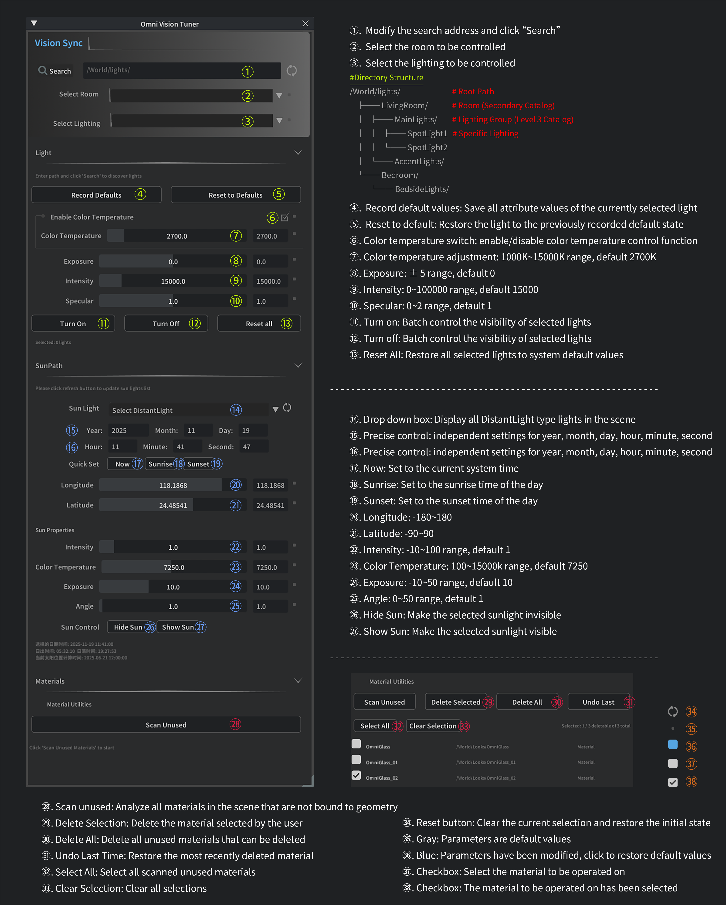

# Omni Vision Tune

> This plugin provides Omniverse users with a set of lighting and material management tools, mainly used for lighting management, sun path simulation, and material management in scenes, especially suitable for users who need to finely control lighting and optimize scene resources.

- Architectural Visualization: Accurate Sunlight Analysis and Lighting Adjustment
- Product rendering: material optimization and lighting layout
- Scenario optimization: Clean up unused resources and improve performance
- Lighting Design: Complex Multi level Lighting System Management

<br>

# Overview

## Quick Start

**Target applications:** NVIDIA Omniverse App

**Supported OS:** Windows and Linux

**Changelog:** [CHANGELOG.md](exts/omni.LightingControl/docs/CHANGELOG.md)

**Table of Contents:**

- [User Guide](#guide)
  - [Preparation](#guide-Preparation)
- [Extension usage](#usage)
  - [Dependencies](#usage-Dependencies)
  - [Adding Extension](#usage-Adding)
- [Usage Tips](#tips)
  - [Lighting Management Process](#tips-Light)
  - [Sun Path Usage Process](#tips-Sun)
  - [Material cleaning process](#tips-Material)
- [Usage Tips](#tips)
- [Usage Tips](#tips)
- [Usage Tips](#tips)

<br>



<hr>

Core Capabilities
- Precision Color Science
Leveraging industry-standard color temperature curves, it enables seamless transitions from cool moonlight to warm sunset glow, ensuring both authentic color reproduction and pure artistic expression.

- Dynamic Intensity Management
Offers global intensity control, from macro scene lighting to micro object fill lights, empowering you to shape visual hierarchy with depth and drama.

- Centralized Command Hub
Through an intuitive unified panel, it enables coordinated switching, grouping, and state management of multiple light sources within a scene, significantly enhancing iteration efficiency.

- Non-Destructive Real-Time Preview
All adjustments are instantly reflected in Omniverse's real-time viewport, achieving zero latency between creative decisions and final results.

<br>
<hr>

<a name="guide"></a>
## 🎯 User Guide
<a name="#guide-Preparation"></a>
### Preparation

**LightManager**

Light organization structure: 
- Ensure that the lights in the scene are organized according to the following structure

```
        LightManager   
        # Directory Structure

        /World/
            ├── lights/                         # Root Path
                ├── LivingRoom/                 # Room (Secondary Catalog)
                │   ├── CeilingLights/          # Lighting Group (Level 3 Catalog)  
                │   │   │   ├── SpotLight1      # Specific Lighting
                │   │   │   └── SpotLight2
                │   └── AccentLights/
                │           └── CylinderLight
                └── Bedroom/
                    └── BedsideLights/
                            └── DiskLight
                
```

**SunManager**

Sunlight requirement:
- There must be at least one DistantLight type light in the scene


<br>


<hr>

<a name="usage"></a>
### Extension usage

<a name="usage-Dependencies"></a>
#### Dependencies
- Requires Omniverse Kit >= 108

<a name="usage-Adding"></a>
### Adding This Extension
To add this extension to your Omniverse app:

1. `Developer` > `Extensions` or `Window` > `Extensions`
2. ☰ > Settings
3. ✚ Add `git:https://github.com/9Din/omni_Lighting_Control/tree/main/exts` folder to the Extension Search Paths
4. The user extension should appear on the left
5. `Autoload` needs to be checked for the FileFormat plugin to be correctly loaded at USD Runtime.
        
Manual installation:

1. Download Zip  ` git clone https://github.com/9Din/omni_Lighting_Control.git `
2. Extract and place into a directory of your choice
3. `Developer` > `Extensions` or `Window` > `Extensions`
4. ☰ > Settings
5. ✚ Add `\omni_Lighting_Control\exts` folder to the Extension Search Paths
6. The user extension should appear on the left
7. `Autoload` needs to be checked for the FileFormat plugin to be correctly loaded at USD Runtime.

<hr>

<a name="tips"></a>
## 🗒️ Usage Tips

<a name="tips-Light"></a>
### 💡 Lighting Management Process 

1. Search for lighting structure
- Enter the root path of the light in the path box
- click Search button
- The system automatically recognizes rooms and lighting groups
2. Select the lights to be controlled
- Select a room from the "Select Room" dropdown menu
- Select a lighting group from the "Select Lighting" dropdown menu
- All lights in this group will be automatically selected
3. Adjust lighting properties
- Use sliders or directly input numerical values to adjust parameters
- The modification takes effect immediately and can be viewed in real-time in the viewport
4. Save personal presets
- After adjusting to the desired effect, click on "Record Defaults"
- Afterwards, it can be restored at any time through 'Reset to Defaults'

<a name="tips-Sun"></a>
### ☀️ Sun Path Usage Process

1. Select sunlight
- Click the refresh button to retrieve the list of high beams in the scene
- Select the light to be used as the sun from the drop-down menu
2. Set time and location
- Enter specific date and time, or use quick settings
- Set the geographic location coordinates of the scene
3. Fine tune the sun effect
- Adjust the intensity, color temperature, and other attributes of sunlight according to demand
- Use Show/Hide to control the visibility of the sun

<a name="tips-Material"></a>
### 🧱 Material cleaning process

1. Scan unused materials
- Click 'Scan Unused' to start analysis
- View unused materials displayed in the list
2. Select the material to be deleted
- Check the checkbox before selecting the material
- Be careful to avoid the protected material marked as "(offset)"
3. Perform deletion operation
- Click 'Delete Selected' to delete the selected material
- Or click "Delete All" to clean up with just one click
4. Error Recovery
- When accidentally deleted, the 'undo last' operation can be used to undo it


